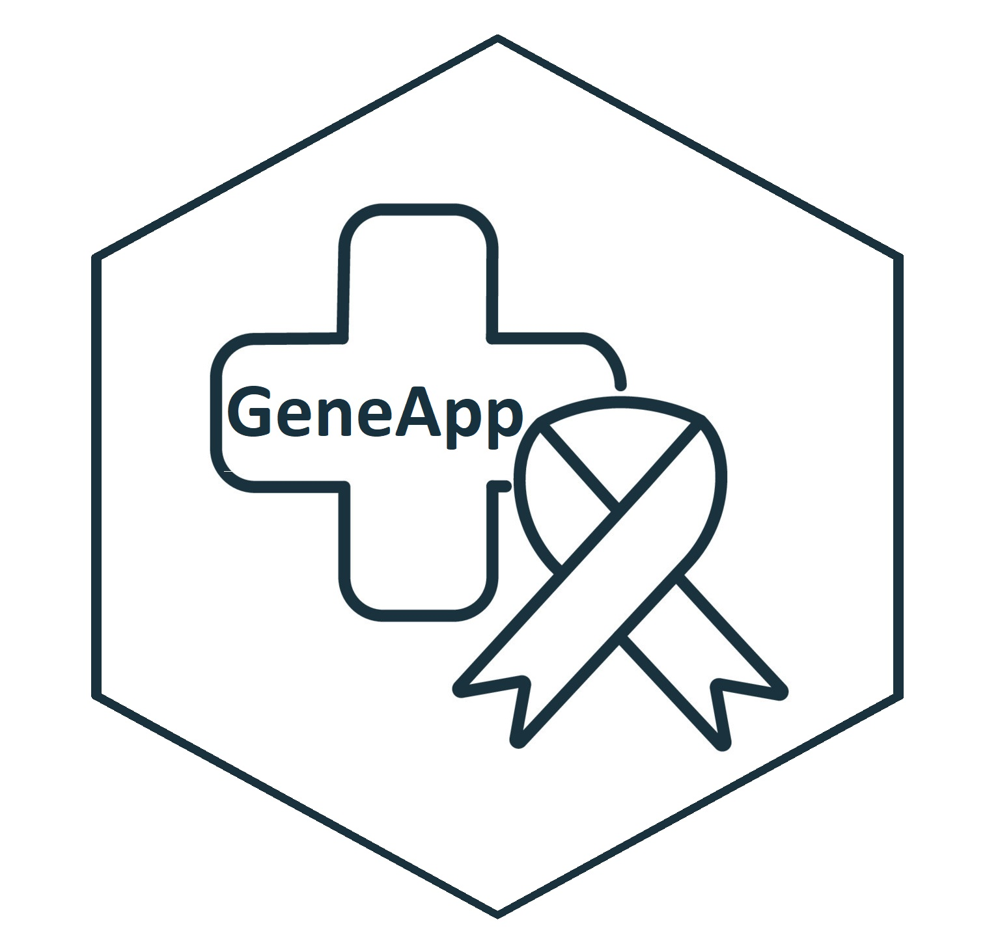

# GeneApp: Interactively Explore Genetic Data 

**Version 0.9**

## Overview

You are visiting the Github repository of the GeneApp package.  

GeneApp is a browser-based interface for interactive exploratory
analysis of genomic data in [R](https://www.r-project.org/). The
application is based on the [Shiny](https://shiny.rstudio.com/) package
and can be run locally or on a server.

The ultimate goal of the project is to provide an intuitive interface,
with a comprehensive set of tools, that will help researchers to import,
explore and visualize mutational data of large cancer genomics
studies.  
Users also have the opportunity to download summaries and reports in
various formats to best reflect their analysis.  
Due to the heterogeneous nature of genomic data there are some
restrictions on the formatting of the files and data sets that the app
can handle, all the details are listed in the [Advanced
Usage](#advanced-usage) section.  

## Key Features

GeneApp has two main purposes:  

- Provide a fast way to researchers to explore and confront somatic and
  germline mutational data with different metrics.  
- Enable users to combine data from multiple data sets to make
  meaningful analyses and summaries of large  
  cancer genetic studies.  

#### Supply samples

Submit data from your local machine or select it from the samples stored
remotely on the app’s server.

#### Convert your data

GeneApp can be used to view different kinds of data, it can act as a
simple file reader for generic relational data but if it’s supplied with
specific genetic data, it will recognize it and process it according to
the MAF format, even if the starting data was using another genetic
standard.

#### Explore Interactively

GeneApp is interactive. Results and plots update immediately when inputs
are changed. This allow for fast exploration and visualization to better
understand the data you are working with.

#### Share your discoveries

Generate a wide array of file outputs and reports to better reflect the
results of your analysis and to share more meaningful data.

#### Context

GeneApp is a tool made with the aim of making life easier to genetics
researchers, so I am hopeful that it will be particularly helpful in
assisting in the genetic research effort.  

If you are interested to see what GeneApp has to offer, click
here.(link)  

## Enviroment setup and Installation

If you are in to test GeneApp from within R, run the following in your R
session to install the GeneApp package current development version from
Github. (not in a docker container)  

GeneApp works on Windows and Linux. It can run locally, even without an
Internet connection or you can also run the app as a web application on
a server.

- Required: [R](https://cran.r-project.org/) version 4.2.0 or later

<!-- -->


    if (!require("devtools")) {
      install.packages("devtools")
    }

    install.packages(c("data.table", "dplyr", "DT", "kableExtra", 
    "mclust", "kit", "knitr", "magrittr", "purrr", 
    "shiny", "BiocManager", "shinyFiles", "shinyjs", "shinyWidgets", "stringr", "writexl"))

    BiocManager::install("maftools")

    devtools::install_github("FilippoMazzara/Progetto_IFO")

    library("geneApp") 

Instead of installing it directly from github you could also download
the repository and install it as a normal R package. In this
configuration the server stored files must be supplied to the app by
putting them into the datasets folder inside the geneApp directory, the
relative path is geneApp/inst/shinyapps/shiny_geneApp/datasets.

then to run the app simply call the launcher function
`geneApp::run_geneApp()` from the console. unfortunately there is not
yet a release available on CRAN.  

The development environment of this project can also be encapsulated in
a Docker container.  
If you have already downloaded a pre built Docker image of the app just
follow steps 6 and 7 of this guide.

Here are the steps required to set up the Docker image on Windows. The
same logic applies if you are trying it on Linux.  
The Dockerfile is located in the root folder of the app.  

1.  Install Docker. Follow the instructions on:  

<https://docs.docker.com/install/>  

2.  Verify the correct installation of Docker on your system.  

3.  Download the package from the Github repository.  

4.  From the console, set your working directory to the geneApp root
    folder:  


        cd yourPathTo\geneApp

      

5.  Build the docker image, executing the following commands, it may
    take a while:


        docker build . -t $IMAGE

      
    To execute this you’ll need an internet connection and Docker
    running on your system.  
    You should see lots of container build messages.  

6.  Run the image, typing the following in the console:  


        docker run -v $pathToServerData:/inst/shinyapps/shiny_geneApp/datasets  -p $PORT:3838 $IMAGE

      

- \$IMAGE is the name you are giving to the image.  
- \$pathToServerData is the path to the directory containing the data
  sets that the app will be accessing.  
- \$PORT is the port that will be used to access the app. By default it
  is set to 3838.  

7.  Open
    <a href="http://localhost:$PORT" class="uri">http://localhost:$PORT</a>
    in your browser to start an instance of the app relative to the
    corresponding container.  

These last steps can also be done through the Docker app, just remember
to correctly set the container options.  

Once geneApp will be released to CRAN these steps will be significantly
easier.  

## Basic Usage

When GeneApp starts you are greeted by the home page from where you can
start navigating the app. The main section of the app is the overview
page, this is where the users can find all the important functions, you
can navigate there by clicking the link on the home page or by clicking
‘Overview’ on the top navigation bar.  
The two main services are the comparison between somatic and germline
data sets and the combining of multiple different genetic samples. They
mainly differ in their purposes and in the way the data is presented but
both work with very similar UI elements and workflows, so I will quickly
go over them.

- From the sidebar a user can decide whether to upload a file/s from
  it’s local filesystem, or to choose from a set of files that are
  hosted on the server. In the ‘Combine’ view you are able to upload
  multiple files at once. In the [Advanced Usage](#advanced-usage)
  section you can find all the details about the formatting of files and
  the inner workings of the conversions.

  After a brief loading, if everything worked out, the chosen data
  should be ready to explore and you should have a few tools at your
  disposal, in particular:

- In the main panel of the selected view you will have the table
  containing your data in the center, you can navigate it and you are
  also able to select rows and copying them to your clipboard by
  clicking the apposite button. You can also reorder the columns by
  dragging and dropping on the column names in the table’s header and
  filter the records through the filters present on top of the table and
  in the sidebar. There are individual text search boxes for each column
  and a main search prompt for all the table’s records.

- On top of the table you will have a collapsible box containing some of
  the possible statistics and plots. These follow the changes in your
  data and are rendered in real time.

- In the sidebar you will then have multiple boxes you can interact
  with, they are all positioned below the file upload box and they are
  all collapsible. From them, in order, you can choose to hide and show
  columns of the corresponding table, toggle various filters and apply
  them to your data. Lastly you can export the final explored data in
  various formats with a wide array of options.

- There is also a statistics panel containing the collapsible box with
  more plots and stats about your data.

If there are errors with the reading of the data or its exploration,
warning and error messages will be displayed on the top part of sidebar
and along side the interested plots and tables. All the UI elements
should be pretty friendly and intuitive to use, if you find yourself
having problems there are some useful tool tips sprinkled along the UI.
In the Help page you can find more helpful tips and the app’s user
guide. In the About page there are all the useful links, licenses and
contact information.

To close the application close the browser window and then click `Stop`.
The GeneApp process will stop and the browser window will close (Chrome)
or gray-out. If the app is running inside a container you’ll just have
to exit the app and then stop the container.  

## Advanced Usage

For security and performance reasons the user uploaded files will only
be processed but not saved on the server that’s running the app. File
uploads are limited to a total of 120Mb. The supported formats are the
same on both the client and server sides, they are: .csv .tsv .xls .xlsx
.maf

When a file that is not already in MAF standard is chosen the app will
try to turn it the closest it can to MAF standard in order to understand
the data more easily. If the transformation is not possible then the app
will still show the file but display a warning and many of the
funcionalities will not be available. If the file is not readable at all
it will show an error.  

If you are having problems visualizing your file you should check
whether they are MAF compatible
[here](https://www.bioconductor.org/packages/devel/bioc/vignettes/maftools/inst/doc/maftools.html#1_Introduction).  
There is a possibility that with a few tweaks your file can also be
adapted to work fine in the app, still in many cases if your file is
using another genetic standard is very likely that you do not need this
because the app will handle all the conversions for you!  

The app will warn you if some of the following columns names are missing
from your data set, not all of them are strictly required for the MAF
standard.

    ```
    c("Gene", "Hugo_Symbol", "Chromosome", "VAF", "Variant_Classification", "Variant_Type",
     "VARIANT_CLASS", "CLIN_SIG", "t_depth", "Reference_Allele", "Tumor_Seq_Allele2", "Start_Position",
    "End_Position", "Existing_Variation", "HGVSp", "EXON", "Tumor_Sample_Barcode")
    ```

If the following columns are present in the final data set you will be
able to select the respective filter from the sidebar:

    ```
    c("Chromosome", "VAF", "Variant_Classification", "Variant_Type", "VARIANT_CLASS",
    "CLIN_SIG", "t_depth", "Start_Position", "End_Position")
    ```

If you are still having problems or if you just want to make a
contribution for the project here are some of the inner workings of the
conversion:

All the column names in your files are tried to be matched with the MAF
standard column names through these case insensitive pairing lists:

<table class="table" style="width: auto !important; margin-left: auto; margin-right: auto;">
<tbody>
<tr>
<td style="text-align:left;font-weight: bold;text-align: center;">
MAF
</td>
<td style="text-align:left;text-align: center;">
</td>
<td style="text-align:left;text-align: center;">
</td>
<td style="text-align:left;text-align: center;">
</td>
<td style="text-align:left;text-align: center;">
</td>
</tr>
<tr>
<td style="text-align:left;font-weight: bold;">
Gene
</td>
<td style="text-align:left;">
gene.refgene
</td>
<td style="text-align:left;">
gene
</td>
<td style="text-align:left;">
</td>
<td style="text-align:left;">
</td>
</tr>
<tr>
<td style="text-align:left;font-weight: bold;">
Hugo_Symbol
</td>
<td style="text-align:left;">
hugo_symbol
</td>
<td style="text-align:left;">
</td>
<td style="text-align:left;">
</td>
<td style="text-align:left;">
</td>
</tr>
<tr>
<td style="text-align:left;font-weight: bold;">
Chromosome
</td>
<td style="text-align:left;">
chr
</td>
<td style="text-align:left;">
chrom
</td>
<td style="text-align:left;">
chromosome
</td>
<td style="text-align:left;">
</td>
</tr>
<tr>
<td style="text-align:left;font-weight: bold;">
Reference_Allele
</td>
<td style="text-align:left;">
reference_allele
</td>
<td style="text-align:left;">
ref
</td>
<td style="text-align:left;">
</td>
<td style="text-align:left;">
</td>
</tr>
<tr>
<td style="text-align:left;font-weight: bold;">
Tumor_Seq_Allele2
</td>
<td style="text-align:left;">
tumor_seq_allele2
</td>
<td style="text-align:left;">
alt
</td>
<td style="text-align:left;">
</td>
<td style="text-align:left;">
</td>
</tr>
<tr>
<td style="text-align:left;font-weight: bold;">
VAF
</td>
<td style="text-align:left;">
vaf
</td>
<td style="text-align:left;">
t_vaf
</td>
<td style="text-align:left;">
</td>
<td style="text-align:left;">
</td>
</tr>
<tr>
<td style="text-align:left;font-weight: bold;">
Variant_Classification
</td>
<td style="text-align:left;">
variant_classification
</td>
<td style="text-align:left;">
func.refgene
</td>
<td style="text-align:left;">
</td>
<td style="text-align:left;">
</td>
</tr>
<tr>
<td style="text-align:left;font-weight: bold;">
Variant_Type
</td>
<td style="text-align:left;">
variant_type
</td>
<td style="text-align:left;">
exonicfunc.refgene
</td>
<td style="text-align:left;">
</td>
<td style="text-align:left;">
</td>
</tr>
<tr>
<td style="text-align:left;font-weight: bold;">
VARIANT_CLASS
</td>
<td style="text-align:left;">
variant_class
</td>
<td style="text-align:left;">
</td>
<td style="text-align:left;">
</td>
<td style="text-align:left;">
</td>
</tr>
<tr>
<td style="text-align:left;font-weight: bold;">
CLIN_SIG
</td>
<td style="text-align:left;">
clin_sig
</td>
<td style="text-align:left;">
clinvar
</td>
<td style="text-align:left;">
</td>
<td style="text-align:left;">
</td>
</tr>
<tr>
<td style="text-align:left;font-weight: bold;">
t_depth
</td>
<td style="text-align:left;">
depth
</td>
<td style="text-align:left;">
t_depth
</td>
<td style="text-align:left;">
</td>
<td style="text-align:left;">
</td>
</tr>
<tr>
<td style="text-align:left;font-weight: bold;">
Start_Position
</td>
<td style="text-align:left;">
start_position
</td>
<td style="text-align:left;">
start
</td>
<td style="text-align:left;">
</td>
<td style="text-align:left;">
</td>
</tr>
<tr>
<td style="text-align:left;font-weight: bold;">
End_Position
</td>
<td style="text-align:left;">
end_position
</td>
<td style="text-align:left;">
end
</td>
<td style="text-align:left;">
</td>
<td style="text-align:left;">
</td>
</tr>
<tr>
<td style="text-align:left;font-weight: bold;">
Existing_Variation
</td>
<td style="text-align:left;">
existing_variation
</td>
<td style="text-align:left;">
aachange.refgene
</td>
<td style="text-align:left;">
variation
</td>
<td style="text-align:left;">
var
</td>
</tr>
<tr>
<td style="text-align:left;font-weight: bold;">
HGVSp
</td>
<td style="text-align:left;">
hgvsp
</td>
<td style="text-align:left;">
</td>
<td style="text-align:left;">
</td>
<td style="text-align:left;">
</td>
</tr>
<tr>
<td style="text-align:left;font-weight: bold;">
EXON
</td>
<td style="text-align:left;">
exon
</td>
<td style="text-align:left;">
</td>
<td style="text-align:left;">
</td>
<td style="text-align:left;">
</td>
</tr>
<tr>
<td style="text-align:left;font-weight: bold;">
Tumor_Sample_Barcode
</td>
<td style="text-align:left;">
tumor_sample_barcode
</td>
<td style="text-align:left;">
</td>
<td style="text-align:left;">
</td>
<td style="text-align:left;">
</td>
</tr>
</tbody>
</table>

If these do not work a second round of conversion starts where other
pairings are applied in order to address different possible standards
and the missing columns that can be inferred from the other data are
computed like so:

<table class="table" style="margin-left: auto; margin-right: auto;">
<tbody>
<tr>
<td style="text-align:left;font-weight: bold;text-align: center;">
MAF
</td>
<td style="text-align:left;text-align: center;">
</td>
</tr>
<tr>
<td style="text-align:left;font-weight: bold;">
Hugo_Symbol
</td>
<td style="text-align:left;">
symbol
</td>
</tr>
<tr>
<td style="text-align:left;font-weight: bold;">
Reference_Allele
</td>
<td style="text-align:left;">
tumor_seq_allele1
</td>
</tr>
<tr>
<td style="text-align:left;font-weight: bold;">
HGVSp
</td>
<td style="text-align:left;">
hgvsp_Short
</td>
</tr>
<tr>
<td style="text-align:left;font-weight: bold;">
EXON
</td>
<td style="text-align:left;">
exon_number
</td>
</tr>
</tbody>
</table>

If not present the following will be tried to be computed using values
from other columns, if they exist:  

- Tumor_Sample_Barcode is inferred from the file or the data set names,
  if a unique barcode is not supplied an identifier will be added to the
  value to avoid confusion. Samples that share a barcode will be treated
  as one by maftools.  
- VAF is calculated dividing t_depth for t_alt_count, it’s in a 0-100
  scale and values higher than 100 are to be considered as inconsistent
  with the cellularity reported for the sample.  
- Variant_Type is inferred from VARIANT_CLASS, Reference_Allele and
  Tumor_Seq_Allele2  
- Variant_Classification is inferred using Consequence and
  Variant_Type  
- Most of the column types are reduced to the ones that correspond to
  the MAF standard and values formatting errors are tried to be fixed as
  well, this is most significant when merging multiple data sets  

Check out the help page in the app if you want to know even more about
the inner workings of the package.

## Reporting issues

Please use the GitHub issue tracker at
<a href="https://github.com/FilippoMazzara/Progetto_IFO/issues" target="_blank">github.com/FilippoMazzara/Progetto_IFO/issues</a>
if you are experiencing issues using GeneApp or if you want to
contribute to the project. Also feel free to share the specifics of
other genetic standards if you want the app to be able to handle them in
the future. For other questions and comments please contact the author
Filippo Mazzara.

## Development

This web application is written using the R Shiny web framework. It
makes use of custom HTML, CSS and JS,  
It also demonstrates the use various Rmarkdown templates, all in order
to create a fancy user experience.  
It can also be encapsulated inside a Docker container for better
portability and control.  
The UI was mainly made using the bootstrap 3 library in order to make it
fully compatible with shiny. The interface is tested to work on all
major browsers and on almost any mobile device. The app was developed
with best Shiny practices in mind, as the use of Shiny modules,
reactivity and fast server side processing, to name a few. In total
about 5000 lines of code were written for this app in a few months.  
This time included app design and development but also all the required
research to program in R, a language that was foreign to me. Here are
listed just some of the invaluable sources I used to gather all this
knowledge:  

- [R for Data Science](https://r4ds.had.co.nz/index.html)  
- [Advanced R](http://adv-r.had.co.nz/)  
- [Mastering Shiny](https://mastering-shiny.org/index.html)  
- [Engineering Shiny](https://engineering-shiny.org/index.html)  
- [R Packages (2e)](https://r-pkgs.org/)  
- [R Markdown: The Definitive
  Guide](https://bookdown.org/yihui/rmarkdown/)  

Other key R packages that were used for this project are DT,
data.tables, shinyWidgets, shinyFiles, knitr, maftools for all the
genetic analysis needs and the tidyverse packages for the handling of
the data. I also got inspiration from the bslib and pkgdown packages,
but they were not used directly. A list of all the libraries and
packages used will be available on the about page of the app.

## Further Information

This app was developed by Filippo Mazzara an informatics student from
the university “La Sapienza” in Rome, with the supervision of the
esteemed professor Andrea Sterbini. The patronage and the constant
assistance from the team of researchers from the highly regarded
“Hospital Physiotherapy Institutes” (IFO) were essential and defined the
shape of this project. Special thanks go to doctor Matteo Pallocca and
doctor Martina Betti from IFO whose help was crucial.  

For further information, please refer to the articles and function call
references of the package documentation, available at  

- GitHub: [PROGETTOIFO -
  Github](https://github.com/FilippoMazzara/Progetto_IFO)
- University “La Sapienza”: [Professor Andrea
  Sterbini](https://www.di.uniroma1.it/it/docenti/sterbini)
- Istituti Fisioterapici Ospitalieri: [IFO](https://www.ifo.it/)
- Linkedin: [Matteo
  Pallocca](https://it.linkedin.com/in/matteo-pallocca-b38742142)
- EMail: <mazzara.1742740@studenti.uniroma1.it>

## License

GeneApp is licensed under AGPL3 (see
<https://tldrlegal.com/license/gnu-affero-general-public-license-v3-(agpl-3.0>)
and <https://www.r-project.org/Licenses/AGPL-3>). The AGPLv3 license
requires, attribution, including copyright and license information in
copies of the software, stating changes if the code is modified, and
disclosure of all source code.

This program is free software: you can redistribute it and/or modify it
under the terms of the GNU Affero General Public License as published by
the Free Software Foundation, either version 3 of the License, or (at
your option) any later version.

This program is distributed in the hope that it will be useful, but
WITHOUT ANY WARRANTY; without even the implied warranty of
MERCHANTABILITY or FITNESS FOR A PARTICULAR PURPOSE. See the GNU Affero
General Public License for more details.

You should have received a copy of the GNU Affero General Public License
along with this program. If not, see <https://www.gnu.org/licenses/>.

The documentation, the help files and images for the `GeneApp` package
are licensed under the creative commons
Attribution-NonCommercial-NoDerivatives 4.0 International (CC BY-NC-ND
4.0)
<a href="https://creativecommons.org/licenses/by-nc-nd/4.0/" target="_blank">BY-NC-ND</a>.

If you are interested in using the package please feel free to email me
at <mazzara.1742740@studenti.uniroma1.it>

© Filippo Mazzara (2023)
<a rel="license" href="https://creativecommons.org/licenses/by-nc-nd/4.0/" target="_blank"></a>

Copyright 2023 Filippo Mazzara. All rights reserved.

Enjoy!
